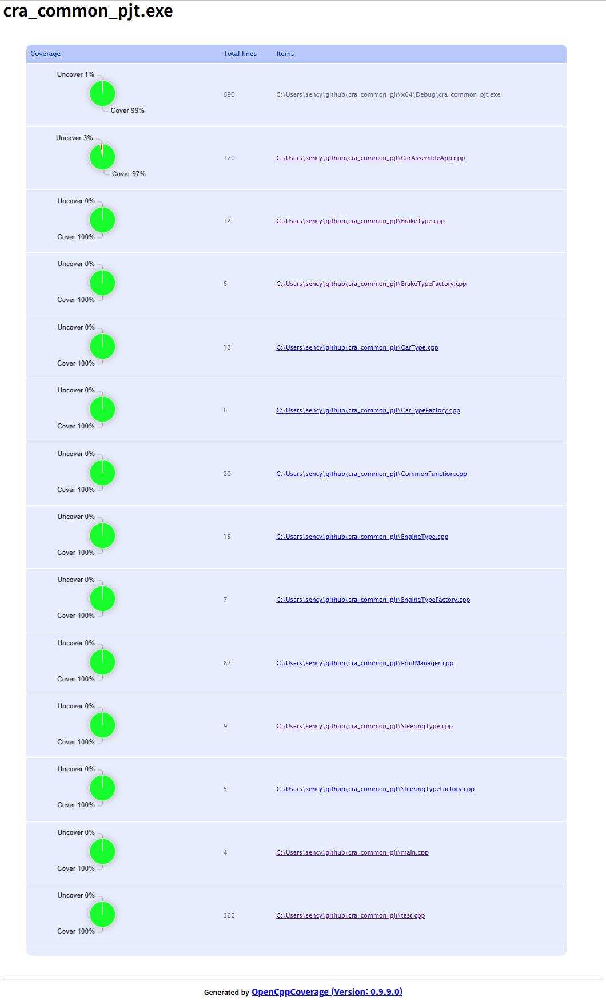
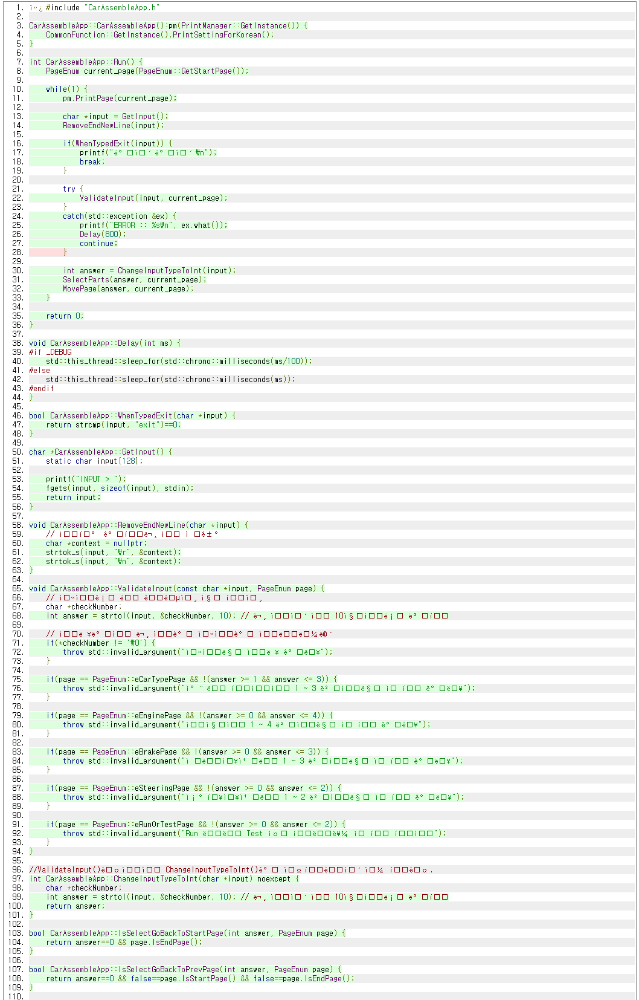
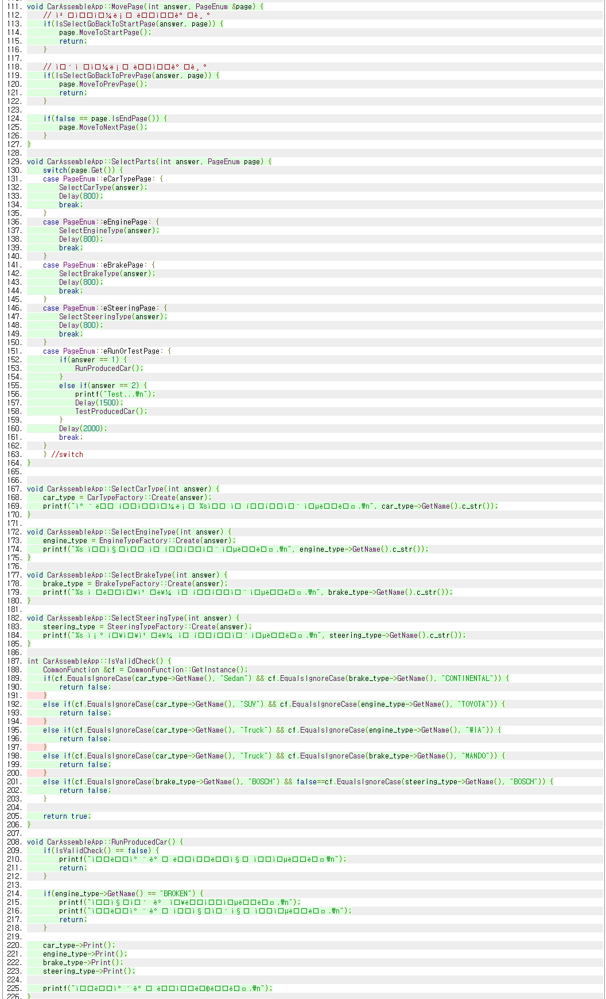
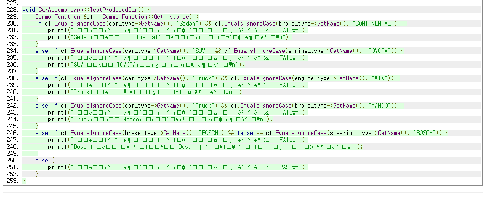

# cra_common_pjt
250912 CRA 9차수 공통과제 (cpp)

---
# Notice
printf()로 출력하는 한글이 깨져
아래와 같은 코드를 추가하였습니다.

```cpp
#pragma execution_character_set("utf-8")
#include <windows.h>
/* ... */

SetConsoleOutputCP(CP_UTF8);
SetConsoleCP(CP_UTF8);
```

# CheckList
| Spec | Done |
| ------------- | ------------- |
| D1 | O |
| D2 | O |
| D3 | O |
| D4 | O |
| D5 | O |

# Code Coverage
실제 coverage측정 결과는 coverage/index.html 에 있습니다.





